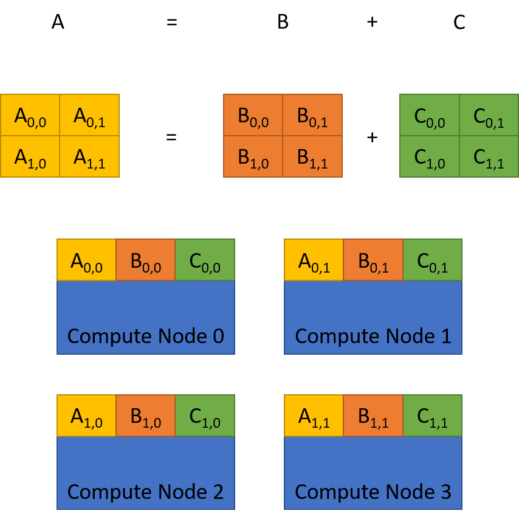

# TilingSolver

This project was created to aid in making tiling decisions for distributed
matrix applications, specifically with an eye for applications in the Phylanx 
(https://github.com/stellar-group/phylanx) project.

By tiling we mean the decisions regarding how to distribute data across some
number of computational nodes, for example, in a cluster or supercomputer.

